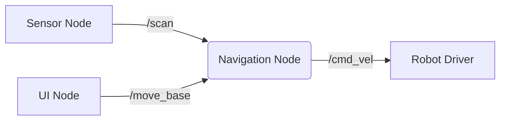

# Nodes, Topics, and Services

<div className="neon-border" style={{ padding: '20px', borderRadius: '8px', backgroundColor: 'var(--ifm-color-emphasis-100)' }}>

## Understanding ROS 2 Communication Patterns

ROS 2 provides three primary communication patterns for nodes to interact with each other:

</div>

1. **Topics** - Publish/subscribe pattern for streaming data
2. **Services** - Request/response pattern for synchronous operations
3. **Actions** - Goal-oriented pattern for long-running tasks with feedback

## Nodes

### What is a Node?

A node is an executable process that uses ROS 2 to communicate with other nodes. Nodes:

- Perform specific tasks (e.g., sensor processing, control algorithms)
- Communicate with other nodes through topics, services, or actions
- Can be written in different programming languages
- Are managed by the ROS 2 execution model

### Creating a Node

In Python, a basic node looks like this:

```python
import rclpy
from rclpy.node import Node

class MinimalPublisher(Node):

    def __init__(self):
        super().__init__('minimal_publisher')
        self.publisher_ = self.create_publisher(String, 'topic', 10)
        timer_period = 0.5  # seconds
        self.timer = self.create_timer(timer_period, self.timer_callback)
        self.i = 0

    def timer_callback(self):
        msg = String()
        msg.data = 'Hello World: %d' % self.i
        self.publisher_.publish(msg)
        self.get_logger().info('Publishing: "%s"' % msg.data)
        self.i += 1
```

## Topics - Publish/Subscribe Pattern

### Core Concepts

Topics enable asynchronous, one-way communication:

- **Publisher**: Sends messages to a topic
- **Subscriber**: Receives messages from a topic
- **Message**: Typed data structure that flows between nodes

### Characteristics

- **Asynchronous**: Publishers and subscribers don't need to run simultaneously
- **Many-to-many**: Multiple publishers and subscribers can use the same topic
- **Data-driven**: Communication triggered by data availability

### Quality of Service (QoS)

Topics support QoS settings to control communication behavior:

```python
from rclpy.qos import QoSProfile, QoSReliabilityPolicy, QoSHistoryPolicy

qos_profile = QoSProfile(
    depth=10,
    reliability=QoSReliabilityPolicy.RELIABLE,
    history=QoSHistoryPolicy.KEEP_LAST
)
```

## Services - Request/Response Pattern

### Core Concepts

Services enable synchronous, two-way communication:

- **Service Client**: Sends a request and waits for a response
- **Service Server**: Processes requests and sends responses
- **Service Type**: Defines the request and response message types

### Characteristics

- **Synchronous**: Client waits for server response
- **One-to-one**: Each request gets one response
- **Request-response**: Well-defined input/output pattern

### Example Service Definition (.srv)

```
# Request
string name
int32 age
---
# Response
bool success
string message
```

## Actions - Goal-Oriented Pattern

### Core Concepts

Actions handle long-running operations with feedback:

- **Goal**: Request for a long-running operation
- **Feedback**: Periodic updates on operation progress
- **Result**: Final outcome of the operation

### Characteristics

- **Asynchronous**: Client doesn't block waiting
- **Interruptible**: Operations can be canceled
- **Progress reporting**: Feedback during execution

## Practical Example: Robot Control System

Let's consider a simple robot control system:

- **Sensor Node**: Publishes laser scan data to `/scan` topic
- **Navigation Node**: Subscribes to `/scan`, provides `/move_base` service
- **UI Node**: Calls `/move_base` service with goal coordinates



## Learning Objectives

By the end of this module, you will be able to:
- Create and manage ROS 2 nodes in Python
- Implement publisher and subscriber nodes
- Design and use service clients and servers
- Understand when to use each communication pattern
- Apply appropriate Quality of Service settings

## Best Practices

1. **Topic naming**: Use consistent, descriptive names (e.g., `/robot_name/sensor_type`)
2. **Message design**: Keep messages focused and efficient
3. **Error handling**: Implement proper error handling for all communication patterns
4. **Resource management**: Properly clean up publishers, subscribers, and services

## What's Next

After mastering these communication patterns, you'll learn how to create complete ROS 2 packages with proper structure and build configuration.