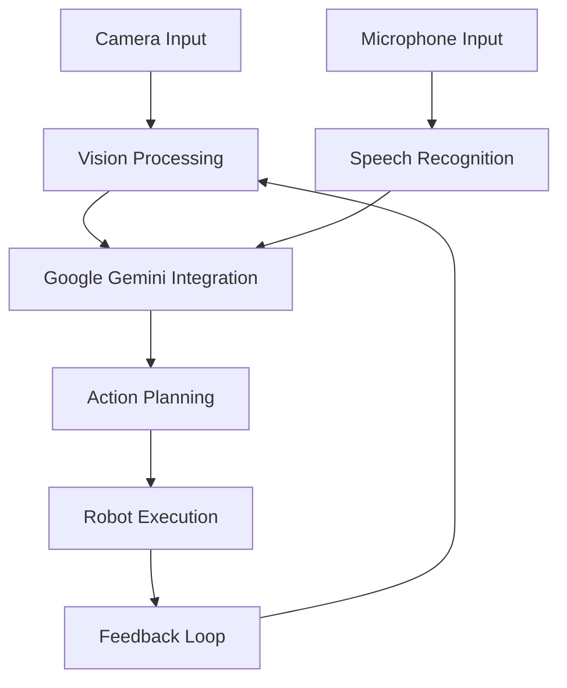

# Multi-Modal Interaction in Robotics

## Overview

Multi-modal interaction combines multiple sensory inputs (vision, speech, touch) and outputs to create more natural and robust human-robot interfaces. This module focuses on Vision-Language-Action (VLA) pipelines that integrate visual perception, natural language understanding, and robotic action execution using Google Gemini as required by our constitution.

## Learning Objectives

By the end of this module, students will be able to:
- Design multi-modal interaction systems combining vision and language
- Implement Vision-Language-Action (VLA) pipelines using Google Gemini
- Create robust interfaces that handle multiple input modalities
- Build conversational robotics systems with visual context awareness

## Prerequisites

- Completed language models in robotics module
- Completed speech recognition module
- Understanding of sensor integration in robotics

## Multi-Modal Interaction Concepts

### What is Multi-Modal Interaction?

Multi-modal interaction involves:
- **Multiple input modalities**: Vision, speech, gesture, touch
- **Multiple output modalities**: Speech, movement, visual feedback
- **Context integration**: Combining information from different sources
- **Natural interaction**: More human-like communication patterns

### Vision-Language-Action (VLA) Framework

The VLA framework connects:
- **Vision**: Processing visual input from cameras and sensors
- **Language**: Understanding and generating natural language
- **Action**: Executing robot behaviors and motor commands

## Implementing Multi-Modal Systems

### Architecture Overview



### Multi-Modal Data Fusion

```python
#!/usr/bin/env python3
# multi_modal_fusion.py

import rclpy
from rclpy.node import Node
from sensor_msgs.msg import Image, CompressedImage
from std_msgs.msg import String
from geometry_msgs.msg import PointStamped
import cv2
from cv_bridge import CvBridge
import numpy as np
import google.generativeai as genai
import json
import base64
from io import BytesIO

class MultiModalFusion(Node):
    def __init__(self):
        super().__init__('multi_modal_fusion')

        # Initialize components
        self.bridge = CvBridge()
        self.model = genai.GenerativeModel('gemini-pro-vision')

        # Latest sensor data storage
        self.latest_image = None
        self.latest_command = None
        self.latest_objects = []

        # Subscribers
        self.image_subscription = self.create_subscription(
            Image,
            'camera/image_raw',
            self.image_callback,
            10
        )

        self.command_subscription = self.create_subscription(
            String,
            'recognized_speech',
            self.command_callback,
            10
        )

        self.objects_subscription = self.create_subscription(
            String,
            'detected_objects',
            self.objects_callback,
            10
        )

        # Publisher for fused understanding
        self.fused_publisher = self.create_publisher(
            String,
            'multi_modal_understanding',
            10
        )

        # Publisher for robot actions
        self.action_publisher = self.create_publisher(
            String,
            'robot_actions',
            10
        )

        # Timer for processing fused data
        self.process_timer = self.create_timer(1.0, self.process_fused_data)

        self.get_logger().info('Multi-modal fusion node initialized')

    def image_callback(self, msg):
        """Handle incoming image data"""
        try:
            # Convert ROS image to OpenCV format
            cv_image = self.bridge.imgmsg_to_cv2(msg, "bgr8")
            self.latest_image = cv_image
        except Exception as e:
            self.get_logger().error(f'Error converting image: {e}')

    def command_callback(self, msg):
        """Handle incoming command data"""
        self.latest_command = msg.data

    def objects_callback(self, msg):
        """Handle incoming object detection data"""
        try:
            self.latest_objects = json.loads(msg.data)
        except json.JSONDecodeError:
            self.get_logger().error('Error parsing object detection data')

    def process_fused_data(self):
        """Process multi-modal data when all inputs are available"""
        if self.latest_image is not None and self.latest_command is not None:
            # Process with Google Gemini
            understanding = self.process_with_gemini_vision(
                self.latest_image,
                self.latest_command,
                self.latest_objects
            )

            if understanding:
                # Publish fused understanding
                fused_msg = String()
                fused_msg.data = json.dumps(understanding)
                self.fused_publisher.publish(fused_msg)

                # Publish actions if available
                if 'action_sequence' in understanding:
                    action_msg = String()
                    action_msg.data = json.dumps(understanding['action_sequence'])
                    self.action_publisher.publish(action_msg)

                self.get_logger().info(f'Processed multi-modal command: {self.latest_command}')

            # Clear processed data
            self.latest_command = None

    def process_with_gemini_vision(self, image, command, objects):
        """Process image and text with Gemini Pro Vision"""
        try:
            # Convert OpenCV image to base64 for Gemini
            _, buffer = cv2.imencode('.jpg', image)
            image_bytes = buffer.tobytes()

            # Prepare prompt
            prompt = f"""
            You are a robot perception and action planning system. Based on the image provided,
            understand the scene and interpret the following command: "{command}"

            Detected objects in the scene: {json.dumps(objects)}

            Provide a JSON response with:
            1. scene_understanding: Description of what you see in the image
            2. command_interpretation: How the command should be interpreted in this context
            3. action_sequence: Specific actions to execute
            4. target_object: Object related to the command (if applicable)
            5. spatial_relationships: Relationships between objects relevant to the command
            6. confidence_score: Confidence in interpretation (0.0 to 1.0)
            """

            # Create PIL image from bytes for Gemini
            import PIL.Image
            pil_image = PIL.Image.fromarray(cv2.cvtColor(image, cv2.COLOR_BGR2RGB))

            # Call Gemini vision model
            response = self.model.generate_content([prompt, pil_image])

            # Parse response
            response_text = response.text.strip().strip('```json').strip('`')
            result = json.loads(response_text)
            return result

        except Exception as e:
            self.get_logger().error(f'Error processing with Gemini Vision: {e}')
            return {
                "scene_understanding": "Failed to process image",
                "command_interpretation": "Failed to interpret command",
                "action_sequence": ["error"],
                "target_object": None,
                "spatial_relationships": [],
                "confidence_score": 0.0
            }

def main(args=None):
    rclpy.init(args=args)
    fusion_node = MultiModalFusion()

    try:
        rclpy.spin(fusion_node)
    except KeyboardInterrupt:
        pass
    finally:
        fusion_node.destroy_node()
        rclpy.shutdown()

if __name__ == '__main__':
    main()
```

## Vision-Language Integration with Google Gemini

### Processing Images with Language Commands

```python
def process_visual_language_command(self, image, command, context):
    """Process a visual scene with a language command using Gemini"""

    # Prepare the multi-modal prompt
    prompt = f"""
    You are a robot assistant with vision capabilities. You see the following scene:

    The user wants you to: "{command}"

    Additional context: {context}

    Analyze the image and provide specific actions. Respond with:
    1. object_location: Where the relevant object is in the image (x, y coordinates)
    2. action_plan: Sequence of actions to accomplish the goal
    3. safety_considerations: Any safety issues to consider
    4. alternative_interpretations: Other possible interpretations of the command
    """

    # Use Gemini Pro Vision for multi-modal processing
    model = genai.GenerativeModel('gemini-pro-vision')

    # Process the image and text together
    response = model.generate_content([
        prompt,
        image  # PIL Image object
    ])

    return self.parse_gemini_response(response.text)

def parse_gemini_response(self, response_text):
    """Parse the response from Gemini into structured data"""
    try:
        # Remove code block markers if present
        clean_response = response_text.strip().strip('```json').strip('`')
        result = json.loads(clean_response)
        return result
    except json.JSONDecodeError:
        # If JSON parsing fails, try to extract the key information
        return {
            "object_location": None,
            "action_plan": ["unknown"],
            "safety_considerations": [],
            "alternative_interpretations": [response_text]
        }
```

## Advanced Multi-Modal Techniques

### Attention Mechanisms for Multi-Modal Data

```python
class MultiModalAttention:
    def __init__(self):
        # In a real implementation, this would contain neural network models
        pass

    def fuse_modalities(self, visual_features, linguistic_features):
        """Fuse visual and linguistic features using attention mechanisms"""
        # This is a conceptual implementation
        # In practice, you'd use deep learning models
        fused_features = {
            'visual_context': visual_features,
            'linguistic_context': linguistic_features,
            'attention_weights': self.compute_attention_weights(visual_features, linguistic_features)
        }
        return fused_features

    def compute_attention_weights(self, visual, linguistic):
        """Compute attention weights between modalities"""
        # Placeholder implementation
        return {"visual_weight": 0.6, "linguistic_weight": 0.4}
```

## Conversational Robotics with Visual Context

### Maintaining Conversation State with Visual Memory

```python
class ConversationalRobot:
    def __init__(self):
        self.model = genai.GenerativeModel('gemini-pro')
        self.conversation_history = []
        self.visual_memory = {}  # Store objects seen in different contexts
        self.current_scene = None

    def update_visual_memory(self, image, detected_objects):
        """Update visual memory with current scene"""
        import hashlib

        # Create a hash of the current scene for reference
        scene_hash = hashlib.md5(str(detected_objects).encode()).hexdigest()

        self.visual_memory[scene_hash] = {
            'timestamp': self.get_current_time(),
            'objects': detected_objects,
            'image_reference': scene_hash,
            'associated_commands': []
        }

        self.current_scene = scene_hash

    def process_conversational_command(self, command, image):
        """Process a command in conversational context with visual information"""

        # Prepare context including conversation history and visual information
        context = {
            'conversation_history': self.conversation_history[-5:],  # Last 5 exchanges
            'current_objects': self.visual_memory.get(self.current_scene, {}).get('objects', []),
            'current_scene_hash': self.current_scene
        }

        prompt = f"""
        You are a conversational robot with visual memory. You're in a conversation with a user.

        Conversation History:
        {json.dumps(context['conversation_history'])}

        Current Scene Objects:
        {json.dumps(context['current_objects'])}

        User says: "{command}"

        Respond appropriately considering both the conversation context and visual information.
        Provide actions to execute and update the conversation state.

        Respond with JSON containing:
        1. response_text: What the robot should say back
        2. action_sequence: Actions to execute
        3. update_memory: Whether to update visual memory
        4. conversation_continuation: Whether this continues the conversation
        """

        response = self.model.generate_content(prompt)
        parsed_response = self.parse_gemini_response(response.text)

        # Update conversation history
        self.conversation_history.append({
            'user': command,
            'robot': parsed_response.get('response_text', ''),
            'timestamp': self.get_current_time()
        })

        # Limit conversation history to prevent memory issues
        if len(self.conversation_history) > 20:
            self.conversation_history = self.conversation_history[-10:]

        return parsed_response
```

## Practical Exercise: Complete Conversational Robot

### Objective
Create a complete multi-modal conversational robot system that responds to voice commands with visual context awareness.

### Steps
1. Set up multi-modal fusion node
2. Implement visual context understanding
3. Create conversational state management
4. Test with complex multi-modal commands

### Example Multi-Modal Commands
- "Pick up the red cup you see in front of you"
- "Navigate to the room with the blue chair"
- "Show me the object I was pointing at before"

## Assessment

Students must demonstrate the following:
1. Successfully implement multi-modal data fusion
2. Integrate vision and language using Google Gemini
3. Create a conversational robot with visual context awareness
4. Handle complex multi-modal commands effectively

**Success Threshold: 80% success rate in multi-modal command processing**

## Next Steps

After completing this module, students will have a complete understanding of Vision-Language-Action pipelines and will be ready to implement the capstone project "The Autonomous Humanoid" with all required capabilities.